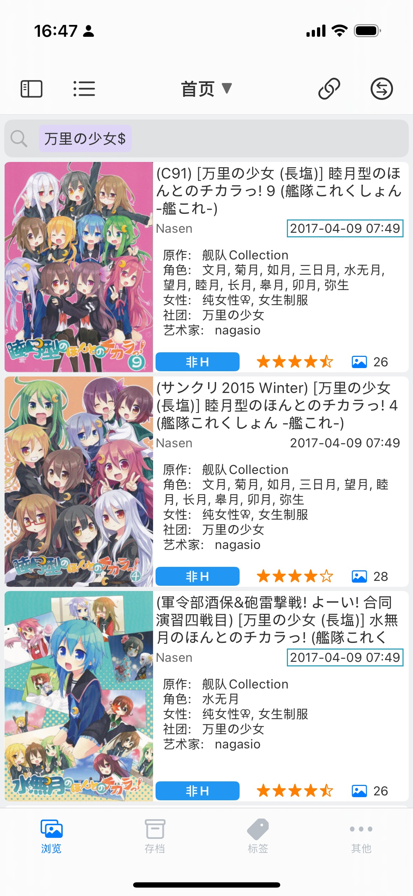
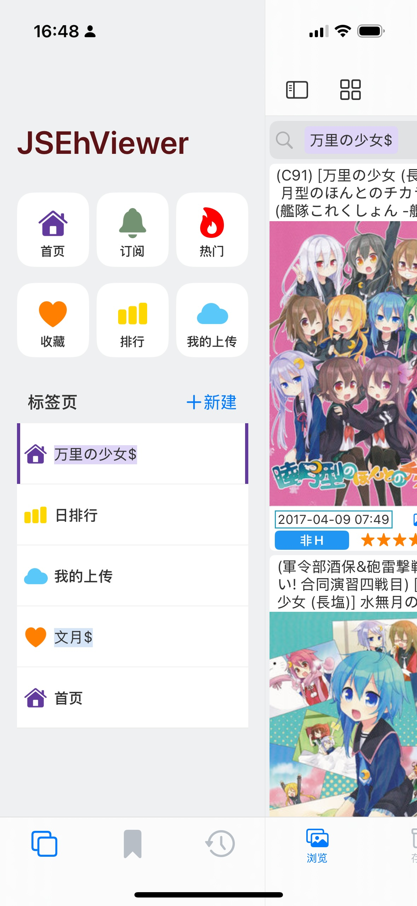
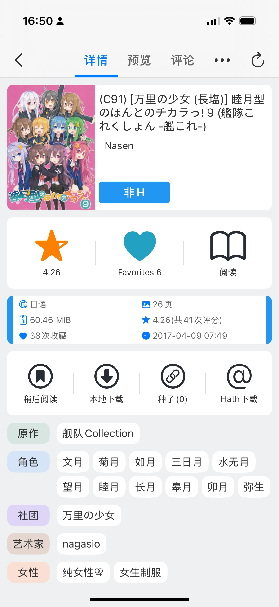
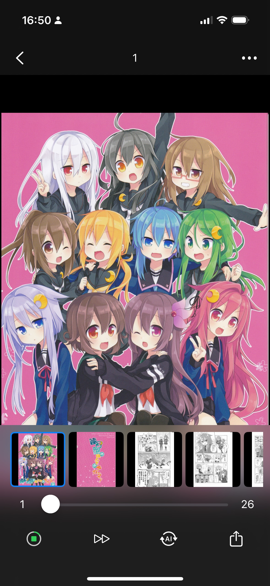

<h1 align="center">
  
  <br>JSEhViewer<br>
</h1>

<div align="center">
  <a href="https://apps.apple.com/app/id1312014438" target="_blank"></a>
  <a href="/LICENSE" target="_blank"></a>
  <a href="https://github.com/Gandum2077/JSEhViewer/issues"></a>
  <a href="https://github.com/Gandum2077/JSEhViewer/releases"></a>
  <a href="https://t.me/jsehviewer" target="_blank"></a>
</div>

# 简介

JSEhViewer 是运行在 iOS 平台 [JSBox](https://apps.apple.com/app/id1312014438) 上的 E-Hentai 阅读应用。

[安装](#安装)<span> | </span>[截图](#截图)<span> | </span>[常见问题](#常见问题)<span> | </span>[相关项目](#相关项目)

本应用致力于带给你良好的 E-Hentai 阅读体验，快捷的操作方式，以及评分、收藏、评论等社区功能。

此外，本应用的一些特色功能：

- 类似浏览器的多标签页切换功能
- 可以浏览“我的上传”列表
- 更加便捷的标签搜索、书签和管理
- WebDAV
- 外部 AI 翻译支持（需自行设置）

[Telegram 聊天群](https://t.me/jsehviewer)

## 安装

需要 iOS 版本 >= 17.0.0, JSBox 版本 >= 2.22.0  
不需要 JSBox 2.0.0 版本之后的付费订阅功能

[一键安装](https://xteko.com/redir?name=JSEhViewer&url=https%3A%2F%2Fgithub.com%2FGandum2077%2FJSEhViewer%2Freleases%2Fdownload%2F3.3.2%2FJSEhViewer.box)

[从 Release 下载](https://github.com/Gandum2077/JSEhViewer/releases)

源码安装：克隆源代码，进入目录并依次执行命令

```
npm i
npm run build
```

随后会在当前目录生成安装包。

## 截图

  

## 常见问题

> 这里主要罗列 JSEhViewer 相关的问题，关于 E 站本身的一些常识性问题，比如如何注册、如何进入里站、如何捐赠、图片配额等，建议阅读下面几篇文章
>
> - [E 绅士里站访问教程——从注册账号到进入里站](https://nicebowl.fun/11)
> - [有关使用机场节点注册 e-hentai 获取和验证里站权限的报告](https://telegra.ph/%E6%9C%89%E5%85%B3e-hentai%E6%B3%A8%E5%86%8C%E8%8E%B7%E5%8F%96%E5%92%8C%E9%AA%8C%E8%AF%81%E9%87%8C%E7%AB%99%E6%9D%83%E9%99%90%E7%9A%84%E6%8A%A5%E5%91%8A-11-09)
> - [ban 以及 509 解决方案](http://sinner.ehentai.info/index.php/archives/31/)
> - [eh 捐献教程](http://sinner.ehentai.info/index.php/archives/3/)
> - [e 站的 3 种货币 GP, C, Hath](http://sinner.ehentai.info/index.php/archives/80/)

### 如何查看和记录日志

在调试模式下运行可以查看日志。所谓调试模式，就是先进入应用的文件目录，然后点下方的运行按钮。

记录日志：将`assets/debug`这个文件的内容从`0`改为`1`，此时运行本应用会在根目录下生成`debug.db`数据库文件记录日志。  
不用时请将`assets/debug`改回`0`以关闭记录日志功能。`debug.db`文件可以随时删除。

> 附注：由于 JSBox 缺少追加写入的功能，没有办法用普通文本文件记录 log，否则会消耗大量系统资源。

### 网络相关

包括无法登录、无法更新标签翻译、获取列表失败、缩略图或图片无法加载等

#### 首先，请保证你的设备可以正常访问下列域名

```
github.com
githubusercontent.com
e-hentai.org
exhentai.org
ehgt.org
hath.network
```

- 无法访问 github.com 和 githubusercontent.com 将导致无法获取标签翻译，从而无法完成登录步骤，如果速度很慢也不行，会超时导致失败
- e-hentai.org 和 exhentai.org 是主站点
- 无法访问 ehgt.org 会导致无法加载缩略图和评论中的图片
- 无法访问 hath.network 会导致加载不了图库的图片

#### 账号有里站权限，但是登录 ExHentai 失败

说明你当前使用的 IP 无法获取里站的 Cookie，使用公共代理更容易出现此问题。请更换低风控值的 IP 再尝试。

#### 509 错误

图片配额不足，无法浏览图片。可以尝试更换 IP，或者直接购买图片配额。

> 如何节约图片配额：
>
> 1. 分辨率建议选择自动或者 1280x，在移动设备上足够清晰且配额消耗较少；
> 2. 在通用设置中关闭“阅读时自动缓存”；
> 3. 对于页数多的图库，建议先用 Safari 归档下载，然后导入到对应图库中。

#### IP 封禁

这将导致全站无法访问。一般是因为 IP 流量太大导致风控。使用公共代理更容易出现此问题。可以使用 [ping0.cc](https://ping0.cc/) 检查你的 IP 风控值。

### UI 相关

#### 怎么退出？

在底栏选择其他 - 右上角有关闭按钮。

#### 阅读时切换页面闪烁

如果你使用“点击和滑动”翻页模式阅读页数很多的图库，同时你的设备性能比较低，那么点击切换页面时可能会闪烁（因为图片重新布局的速度太慢）。可以把翻页模式切换成“仅点击”或者“仅滑动”来规避这个问题。

### 其他问题

#### URL scheme

本应用支持通过 URL scheme 打开，并立即打开特定图库。你可以在 iOS 快捷指令或桌面小组件中使用它。

`jsbox://run?name=JSEhViewer&url={URL}`

其中`{URL}`替换为要打开的图库链接。

#### 可以后台下载吗？

不能，JSBox 没有实现后台任务机制，切换到后台会导致网络连接中断。另外，切换到后台可能导致当前正在下载/缓存的图片无法完成直到超时，请进入对应图库并点击右上角刷新按钮来重启。

#### 为什么没有归档下载功能

由于 JSBox 不能后台下载，也不能断线重连，归档下载几乎无用。建议用 Safari 进行归档下载（Safari 不会受到普通 App 那样的后台下载限制），然后再把下载的压缩包导入到本应用。

#### 导入图库压缩包会闪退

如果压缩包过大，超过了 App 最大 RAM 的限制，可能会闪退。

## 相关项目

在开发本项目的过程中，我编写了三个重要的子项目，以增强 JSBox 的开发体验。如果你也想开发 JSBox 应用，我相信它们会对你有所帮助。

### [JSBox-Types](https://github.com/Gandum2077/JSBox-Types)

✨ **TypeScript 声明文件** | **代码提示 & AI 自纠错**  
**JSBox-Types** 为 JSBox 提供完整的 TypeScript 类型定义，使开发者可以在编辑器中获得完整的代码提示，并显著提高 AI Agent 的自纠错能力。

### [JSBox-CView](https://github.com/Gandum2077/JSBox-CView)

✨ **微型 UI 框架** | **轻量 & 易扩展**  
**JSBox-CView** 是一个专门为 JSBox 设计的 UI 组件框架，内置了许多常用的组件和页面，简化 JSBox 应用的界面开发。

### [Ehentai-Parser](https://github.com/Gandum2077/Ehentai-Parser)

✨ **E-Hentai 解析器** | **兼容 JSBox 和 Node.js**  
**Ehentai-Parser** 是一个完善的 E-Hentai 解析器，适用于需要爬取和解析 E-Hentai 内容的应用，可用于 JSBox 或 Node.js 运行环境。
