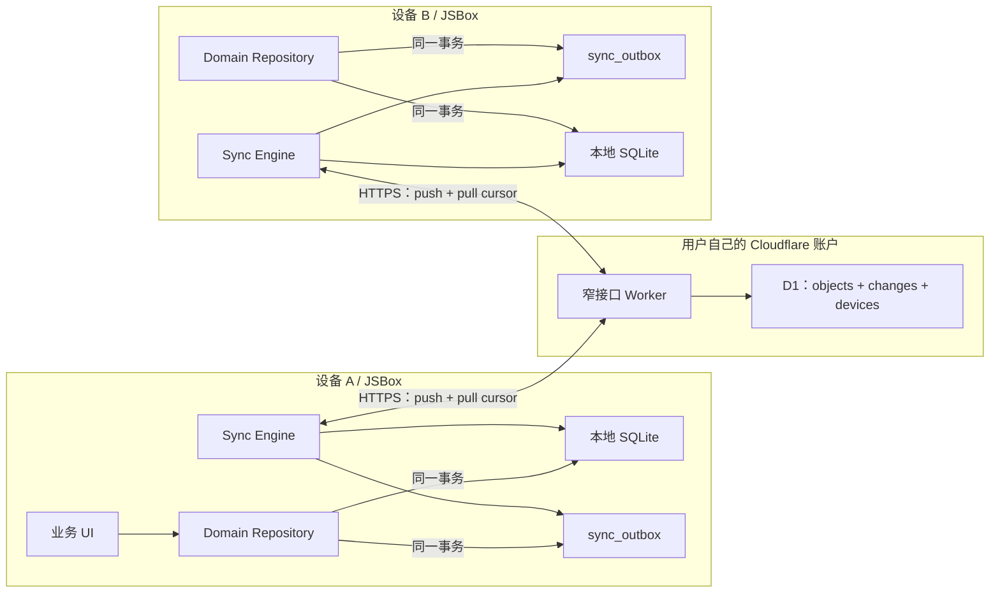

# JSEhViewer Cloudflare D1 多设备同步技术报告

> 报告日期：2026-08-07；修订日期：2026-08-10
> 研究对象：JSEhViewer 3.10.0 当前源码、JSBox SQLite 能力、Cloudflare Workers / D1 / Deploy to Cloudflare 现行能力  
> 文档性质：架构决策与实施依据；不是已经完成的功能说明

> 实施进展：Phase 0 已完成；Phase 1 当前状态和真机事项见 [`cloud-sync-phase1-progress.md`](./cloud-sync-phase1-progress.md)。本报告中的“当前问题”保留初始审计语境。

## 1. 结论先行

### 1.1 总结论

项目可以加入 Cloudflare D1 同步，Cloudflare 的 “Deploy to Cloudflare” 也能自动创建 D1、绑定 Worker、运行迁移并部署。但是可行的产品形态不是“把 `assets/database.db` 上传到 D1”，而是：

- 本机 SQLite 继续作为唯一的低延迟工作数据库，离线时所有操作照常可用；
- JSBox 只访问一个功能很窄的 Worker 同步 API，不直接访问 D1 REST API；
- Worker 在 D1 中保存可同步实体的当前版本、变更日志、设备与配对信息；
- 每次本地业务写入和 outbox 写入必须处于同一个 SQLite 事务；
- 推送必须幂等，拉取必须使用单调 cursor；需要跨设备传播的删除必须保存 tombstone，明确规定仅本机删除的数据除外；
- 同一用户的数台设备可以同时写入，冲突按实体类型自动解决，不要求普通用户理解“冲突副本”；
- `archives` 中构成图库列表所需的元数据快照应同步，但下载状态、图片文件、`infos.json` 等可重新获取的详情缓存以及任何凭据不得同步到 D1；
- 生产版建议对同步 payload 做端到端加密，使 Worker 和 D1 只看到不透明对象，而不能读取阅读记录、书签和标签内容。

这意味着一次明确的本地数据库 breaking migration 和数据访问层重构不可避免。仅在现有 `dbManager.update()` 外面加网络请求，会产生丢更新、删除复活、缓存清理误删云端数据以及凭据泄漏。

### 1.2 Go / No-Go

结论为 **有条件 Go**。以下四项是发布阻断条件：

1. 修复本地 SQLite 错误处理和事务边界；
2. 拆分同步数据、仅本机数据、上游镜像数据和秘密数据；
3. 完成至少双真机的离线、并发、重试、崩溃恢复测试；
4. 若面向公开用户发布，完成并审计客户端端到端加密；若先发布不加密的实验版，必须显著说明 Cloudflare 账户和 Worker 能读取同步内容，并且仍然绝不能上传凭据。

### 1.3 JSBox SQLite 能否完成

**能完成本地同步所需的持久化、事务、outbox、cursor、版本表和 tombstone；但 `$sqlite` 模块本身不能完成整个同步功能。** 还需要：

- `$http`：调用 Worker；
- `$keychain`：保存同步主密钥、设备令牌等秘密；
- 应用生命周期事件：启动、恢复前台、离开阅读器时触发同步；
- 加密实现：JSBox 暴露的 SHA-256 不等于认证加密，生产版还需经过验证的 AEAD/HKDF 实现及安全随机数来源；
- 应用层同步调度：JSBox 没有可靠后台任务，因此不能承诺“关闭应用后继续同步”。

JSBox 官方文档说明其 SQLite 接口基于 FMDB，提供查询、更新和事务，并专门提供 `dbQueue` 解决多线程访问同一数据库的问题。[JSBox SQLite 概览](https://github.com/cyanzhong/jsbox-docs/blob/master/docs/sqlite/intro.md)、[SQLite Queue](https://github.com/cyanzhong/jsbox-docs/blob/master/docs/sqlite/queue.md)、[SQLite Transaction](https://github.com/cyanzhong/jsbox-docs/blob/master/docs/sqlite/transaction.md)。当前项目安装的 `jsbox-types` 声明也包含 `beginTransaction`、`commit`、`rollback`、`dbQueue`、`$http`、`$keychain` 与 `$app.listen`。

### 1.4 大白话：同步到底怎么运作

可以把每台设备想成各自有一本完整账本，Cloudflare 只是交换站：

1. 在设备 A 翻到第 20 页时，App **先立即写入 A 的本地数据库**，所以网络断开也不会丢；同时在“待发送清单”里记一条“图库 X 读到第 20 页”。
2. App 在前台时，会在修改后等 2–5 秒合并连续变化，然后向 Worker 发起一次同步。一次同步同时做两件事：把本机待发送的变化交上去，再取回其他设备尚未见过的变化。
3. Worker 把通过校验的变化写入 D1，并给每条变化一个递增流水号。设备记住自己最后处理到哪个流水号，下次只取后面的内容。
4. 设备 B 若也在前台，会定时同步；它在下一轮取到 A 的第 20 页记录并更新自己的本地数据库。反过来，B 新增的书签也会在 A 的下一轮同步中出现。
5. 因而两台设备同时在线时属于**近实时**：通常数秒到几十秒可见，而不是像聊天软件那样由服务器永久保持连接并瞬时推送。若某台设备处于后台、JSBox 被挂起或应用已关闭，则要等它再次进入前台才会看到变化。
6. 如果 A、B 恰好同时修改同一个项目，双方的操作都可以重复上传；系统会按预先定义的规则选出同一个结果。修改不同项目时则各自保留，不会互相覆盖。

常见术语换成大白话如下：

| 术语           | 大白话含义                                                                                     |
| -------------- | ---------------------------------------------------------------------------------------------- |
| local-first    | 本机先保存、先可用，云端坏了也不妨碍阅读                                                       |
| outbox         | 本机尚未成功交给云端的“待发送清单”                                                             |
| `op_id` / 幂等 | 每张变更单有唯一编号；同一张重发十次也只算一次                                                 |
| cursor         | “我已经看到云端第几号变更”的书签                                                               |
| tombstone      | 对需要跨设备传播的删除，不立刻抹掉记录，而是留下“这个项目已经删除”的纸条，防止旧设备把它带回来 |
| HLC / LWW      | 给并发修改排出稳定先后顺序；同一项目冲突时所有设备最终选中同一个版本                           |
| snapshot       | 设备离线太久时，不再补所有旧流水，而是重新取得一份当前完整清单                                 |
| profile epoch  | “整套同步空间的代号”；清空云端后换新代号，旧设备不能再把旧数据写回来                           |
| 端到端加密     | 手机加密后才上传，只有持有主密钥的设备能看懂内容，Worker 和 D1 只保存密文                      |

## 2. 目标、约束与非目标

### 2.1 目标

- 同一用户在 iPhone、iPad 等数台设备上使用，设备可能同时在线，也可能离线数周后再上线；
- 本地修改立即生效，网络失败不阻塞阅读；
- 重复请求、响应丢失、应用被挂起或杀死时不丢数据；
- 普通用户通过图形化流程自行部署，不安装 CLI，不编写配置，不理解 D1 binding；
- 项目提供代码、部署页面和自诊断，不依赖开发者人工支持；
- 新版 App 应尽量继续兼容用户多年前部署的旧 Worker。

### 2.2 非目标

- 不同步下载文件、缓存图片、收藏图片二进制或 AI 翻译生成图片；
- 不把 D1 当作 E-Hentai 收藏、评分、My Tags 的新权威来源；这些已有上游服务的数据仍以上游为准；
- 不提供任意 SQL 代理接口；
- 不保证 JSBox 位于后台或被 iOS 终止后继续同步；
- v1 不做多用户共享数据库或家庭协作；每次部署服务一个同步 profile。

## 3. 当前本地数据库审计

当前 schema 集中在 [`src/utils/database.ts`](../src/utils/database.ts)，主要读写分散在 [`src/utils/config.ts`](../src/utils/config.ts)、[`src/utils/status.ts`](../src/utils/status.ts)、[`src/utils/favorite-image.ts`](../src/utils/favorite-image.ts)、[`src/utils/api.ts`](../src/utils/api.ts) 和 [`src/index.ts`](../src/index.ts)。

### 3.1 会直接妨碍同步的结构问题

| 问题                             | 当前证据                                                                                                                            | 同步后果                                                                            | 必须采取的措施                                                           |
| -------------------------------- | ----------------------------------------------------------------------------------------------------------------------------------- | ----------------------------------------------------------------------------------- | ------------------------------------------------------------------------ |
| 一个 `archives` 行混合四类数据   | `readlater`、`last_read_page`、`downloaded`、图库列表元数据、E-Hentai 收藏/评分快照同处一行（database.ts 20–45）                    | 任一设备刷新列表元数据都可能覆盖另一设备的阅读进度；`downloaded` 会错误地跨设备传播 | 拆成可同步的列表快照、用户阅读状态、仅本机下载状态和上游状态快照         |
| 整个 `config` 不区分秘密和偏好   | `cookie`、`githubToken`、`mytagsApikey` 位于 config；WebDAV 密码和 AI 服务 config 也在 SQLite（config.ts 25–80、database.ts 54–80） | 整库同步会上传登录 Cookie 和第三方密钥                                              | 同步采用明确 allowlist；v1 不改 AI/WebDAV 表且绝不上传，秘密迁移另立版本 |
| 本机自增 ID                      | `search_history.id`、`search_bookmarks.id`、`ai_translation_services.id` 为 `AUTOINCREMENT`（database.ts 59–66、119–151）           | history/bookmark 跨设备碰撞；AI 服务未来同步时也会碰撞                              | v1 为 history/bookmark 使用稳定 ID；AI 服务稳定 ID 留待后续版本          |
| 子表没有外键和稳定行序           | 两个 search terms 子表无主键、无外键、无 `term_index`                                                                               | 删除可能留下孤儿；`GROUP_CONCAT` 顺序没有 schema 保证                               | 加复合主键、`term_index` 和 `ON DELETE CASCADE`                          |
| 多步业务操作不是单事务           | 存档、标签、阅读配置常由数个独立 `dbManager.update()` 完成（status.ts 1404–1441、1521–1588）                                        | 业务状态已写但 outbox 未写，或相反；崩溃后永久不同步                                | 新增可执行回调的 transaction API；业务写和 outbox 写必须原子提交         |
| update 返回值未检查              | JSBox `db.update()` 返回 `{ result, error }`，当前包装层忽略它（database.ts 242–294）                                               | SQL 失败可能仍然 commit，`try/catch` 不一定捕获失败                                 | 每次 update 检查结果，失败即抛错并 rollback                              |
| query 错误未处理                 | callback 的 `err` 被忽略，`rs === null` 后仍调用 `rs.next()`（database.ts 225–239）                                                 | 数据库或迁移失败时错误不可诊断                                                      | 包装并抛出带 SQL 名称、错误码的异常；日志对参数脱敏                      |
| schema 创建先于版本迁移          | 构造函数先 `createDB()`，再检查 `PRAGMA user_version`（database.ts 297–319）                                                        | 新旧 schema 被混合创建，迁移前提不可靠                                              | 先识别空库/版本，再创建当前 schema 或逐版迁移                            |
| 非幂等建表                       | `favcat_titles` 缺少 `IF NOT EXISTS`（database.ts 112–115）                                                                         | 每次启动都可能返回错误，而当前错误又被忽略                                          | 修复 DDL 并增加 fresh/upgrade schema 测试                                |
| `INSERT OR REPLACE`              | `archives` 使用 replace（status.ts 1321–1347）                                                                                      | 本质为删除后插入；加入外键、触发器和同步日志后副作用危险                            | 改为显式 `INSERT ... ON CONFLICT DO UPDATE`，只更新目标列                |
| 维护性删除和用户删除没有语义差别 | `clearOldReadRecords`、`clearAll` 与用户操作最终都是 `DELETE`（config.ts 1275–1392）                                                | 清缓存可能被误解释为“从所有设备删除”                                                | 通过 domain repository 明确 `localMaintenance` 与 `userMutation` 来源    |

### 3.2 当前表的同步归类

下表是建议的 v1 默认范围。这里需要区分“打开图库时可重新请求的完整详情缓存”和“构成历史/归档列表所必需的数据库快照”：前者可以仅本机保存，后者即使字段源自 E-Hentai，也应同步到新设备，否则新设备无法立即重建用户的图库列表。

| 当前表/字段                                                      | 归类                                | v1 处理                                                            |
| ---------------------------------------------------------------- | ----------------------------------- | ------------------------------------------------------------------ |
| `archives` 的图库标题、标签、缩略图 URL、评分等列表字段          | 图库列表快照 / 上游镜像             | 默认同步；拆到 `archive_entries`。它不是每个图库的 `infos.json`    |
| `archives.readlater`、`last_read_page`、`first/last_access_time` | 用户状态                            | 默认同步；拆到 `reading_state`，附带最少的 `gid/token` 引用        |
| `archives.downloaded`                                            | 设备文件状态                        | 仅本机；拆到 `local_gallery_state`                                 |
| `archives.favorited/favcat/is_my_rating`                         | 图库列表中的上游状态快照            | 可随 `archive_entries` 同步以还原列表，但不得据此反向修改 E-Hentai |
| `archive_taglist`                                                | 从列表 `taglist` 派生的搜索索引     | 索引表本身仅本机；新设备收到 `archive_entries.taglist_json` 后重建 |
| 每个图库的 `infos.json`、评论详情等                              | 可重新获取的详情缓存                | 仅本机；打开图库时按需重新获取                                     |
| `config`                                                         | 混合数据                            | v1 全部仅本机；以后只用逐键 allowlist 增加安全偏好同步             |
| `ai_translation_services`                                        | 脚本、配置、潜在 API Key            | v1 不同步且不改表；稳定 ID、冲突和密钥拆分留待后续版本             |
| `webdav_services`                                                | 服务地址与凭据                      | v1 不同步且不改表；凭据迁移及非秘密字段同步留待后续版本            |
| `translation_data`                                               | 可下载缓存                          | 仅本机                                                             |
| `marked_tags`                                                    | 由 `config.syncMyTags` 决定整表来源 | `0` 时作为本地标签默认同步；`1` 时整表是 E-Hentai 镜像，不进入 D1  |
| `marked_uploaders`                                               | 用户状态                            | 默认同步                                                           |
| `banned_uploaders`                                               | E-Hentai 上游镜像                   | 仅本机缓存                                                         |
| `favcat_titles`                                                  | E-Hentai 上游镜像                   | 仅本机缓存                                                         |
| `search_history` 及 terms                                        | 隐私敏感用户状态                    | v1 默认同步；用户删除只影响本机，首次接入或全量恢复时可从云端重建  |
| `search_bookmarks` 及 terms                                      | 用户创建内容                        | 默认同步；改用稳定 ID 与稳定排序 key                               |
| `tag_access_count`                                               | 本地行为统计                        | 仅本机；否则需要按设备 G-Counter，收益不值得复杂度                 |
| `download_records`                                               | 瞬态恢复数据                        | 仅本机                                                             |
| `gallery_reader_config`                                          | 设备偏好                            | v1 不同步；每台设备单独设置                                        |
| `favorite_images`                                                | 数据库行依赖本机图片文件            | v1 不同步；否则其他设备会出现有记录但无文件的损坏状态              |
| `debug.db`、文件缓存目录                                         | 调试/缓存/二进制                    | 永不同步                                                           |

`marked_tags` 不增加逐行 `origin`。它采用整表模式：当前设备的 `syncMyTags=1` 时，本表完全由 E-Hentai My Tags 覆盖，repository 不生成 D1 outbox，也不把 D1 的本地标签应用到该表；`syncMyTags=0` 时，本表才作为 `marked.tag.local.v1` 参与 D1 同步。`syncMyTags` 本身在 v1 不同步，所以不同设备可以选择不同模式。

模式切换规则固定为：`syncMyTags` 只允许在重新登录时改变。用户确认重新登录后，App 在进入登录流程前删除本机全部 `marked_tags`，无论旧值和新值是什么，都不为这些删除生成 D1 tombstone。新登录选择 `0` 时从 D1 snapshot 重建本地标签；选择 `1` 时停止 D1 标签同步并由 E-Hentai 整表替换。网站上的 My Tags 本来就由 E-Hentai 保存，不复制到 D1。这样不需要 `origin` 字段，也不会误判整表来源。

## 4. 推荐总体架构



关键边界：

- Worker 不接收任意 SQL，只接收经过 JSON Schema 校验的同步操作；
- D1 schema 与本地业务 schema 不相同。D1 是同步协议的存储，不是本地库的远程副本；
- 本地 repository 负责把“用户动作”转换为领域实体变更；清缓存等本机维护操作不产生 outbox；
- remote apply 明确标记来源，不得再次产生 outbox，避免回声循环；
- 同一设备只允许一个 sync 请求在途，所有数据库 apply 串行化。

### 4.1 为什么不直接使用 D1 REST API

直接调用 D1 REST API 需要把 Cloudflare Account ID、Database ID 和有 D1 权限的 Cloudflare API Token 放进 JSBox。普通用户配置困难，令牌权限过大，也等于把 SQL 面暴露给移动端。Worker binding 则能把 D1 隐藏在服务端，只暴露最小权限协议。Cloudflare 官方也把 Worker binding 作为应用查询 D1 的主要方式。[D1 Workers Binding API](https://developers.cloudflare.com/d1/worker-api/)。

### 4.2 为什么不上传整个 SQLite 文件

- D1 不是可由客户端挂载的 SQLite 文件服务；
- 两台设备同时上传最后一个完整文件时必然 last-writer-wins，另一台所有修改一起丢失；
- 文件级方案无法区分本机缓存删除与用户全局删除；
- 当前文件包含 Cookie、API Key 和密码；
- 每次改一页进度都上传全库，延迟、流量、恢复粒度和写放大都很差。

## 5. 同步数据模型与协议

### 5.1 同步实体应足够小

一个冲突单元只表示一项用户意图。建议 v1 使用以下逻辑实体：

| entity type             | 稳定逻辑键                      | payload                                                                | 冲突单位            |
| ----------------------- | ------------------------------- | ---------------------------------------------------------------------- | ------------------- |
| `archive.entry.v1`      | `gid`                           | 构成图库列表所需的标题、缩略图、分类、标签和上游状态快照，不含下载状态 | 单个图库列表项      |
| `reading.progress.v1`   | `gid`                           | `gid`、必要时的 token、页码、最后阅读时间                              | 单个图库进度        |
| `reading.read-later.v1` | `gid`                           | 是否稍后读、加入时间                                                   | 单个图库 membership |
| `search.bookmark.v1`    | bookmark UUID / 规范化查询 hash | 完整 search terms、排序 key                                            | 单个书签            |
| `marked.uploader.v1`    | 规范化 uploader                 | membership                                                             | 单个上传者          |
| `marked.tag.local.v1`   | namespace + name                | watched/hidden/color/weight                                            | 单个本地标签        |
| `search.history.v1`     | 规范化查询 hash                 | terms、最后访问时间                                                    | 单条历史            |

不能把现有 `archives` 行原封不动地当成一个实体，因为其中夹着仅本机的 `downloaded` 和独立更新的阅读进度；也不要把整个书签数组或整个配置表作为一个实体。拆分后的 `archive.entry.v1` 仍会同步图库列表快照，只是不让一次元数据刷新覆盖阅读进度或另一台设备的下载状态。

### 5.2 操作格式

建议每个 outbox operation 至少包含：

```json
{
  "op_id": "uuid-v4",
  "profile_epoch": "uuid-v4",
  "device_id": "uuid-v4",
  "object_key": "hex(HMAC-SHA256(indexKey, entityType + ':' + entityId))",
  "version": { "wall_ms": 1786032000000, "logical": 0, "device_id": "uuid-v4" },
  "deleted": false,
  "envelope": {
    "format": 1,
    "algorithm": "xchacha20-poly1305",
    "key_version": 1,
    "nonce": "base64url",
    "ciphertext": "base64url"
  }
}
```

如暂不做端到端加密，`object_key` 可暂用 `entity_type + entity_id`，`envelope` 可暂用明文 payload；协议仍应保留 envelope/version 层，以便以后升级。但明文实验版与加密生产版最好使用不同 profile，避免原位升级遗留明文。

### 5.3 API

最小接口建议：

- `GET /v1/info`：公开返回 Worker 版本、协议范围、D1 schema 版本、是否完成初始化，不返回任何数据；
- `POST /v1/bootstrap`：一次性部署密钥注册第一台设备；
- `POST /v1/pairing/create`：已认证设备创建短期、一次性配对码；
- `POST /v1/pairing/claim`：新设备用配对码注册自己的设备令牌；
- `POST /v1/recovery/claim`：所有已配对设备均不可用时，使用恢复包中的独立恢复凭据注册替代设备；
- `POST /v1/sync`：在一个请求内 push operations，并 pull `cursor` 之后的 changes；
- `POST /v1/snapshot`：cursor 已过期时分页返回当前 objects（包括 tombstone）；
- `POST /v1/devices/revoke`：撤销丢失设备；
- `POST /v1/profile/reset`：高风险操作；递增 `profile_epoch`，使旧设备的 outbox 无法复活已清空数据。

`POST /v1/sync` 请求示意：

```json
{
  "protocol": 1,
  "request_id": "uuid-v4",
  "device_id": "uuid-v4",
  "profile_epoch": "uuid-v4",
  "cursor": 1842,
  "operations": []
}
```

响应示意：

```json
{
  "protocol": 1,
  "server_time_ms": 1786032000123,
  "acknowledged_op_ids": [],
  "changes": [],
  "next_cursor": 1857,
  "has_more": false,
  "reset_required": false
}
```

约束建议：一次最多 100 个 operation、单个明文 payload 最多 32 KiB、请求体应用级最多 256 KiB、一次最多返回 500 个 change。平台允许的请求体远大于此，但主动收紧能限制内存、滥用和意外大对象。D1 单行上限为 2 MB、单语句最多 100 个绑定参数；应用限制应显著更小。[D1 limits](https://developers.cloudflare.com/d1/platform/limits/)。

### 5.4 幂等、cursor 与崩溃恢复

从使用者角度看，`POST /v1/sync` 就是“先交作业，再领新作业”：请求中带上本机待发送变化和上次看到的流水号；Worker 写完本机变化后，在同一轮响应里返回此后所有变化。因此同步不是只上传或只下载，而是每一轮都可以双向交换。设备没有本地变化时也可以发送空 `operations` 来纯拉取。

1. `op_id` 全局唯一；重复推送同一操作不得再次制造 change；
2. D1 对 object 的写入使用条件 UPSERT，只有新版本严格大于已有版本才更新；
3. object 的 INSERT/实际 UPDATE 由 trigger 追加到 `changes`，陈旧操作和完全重复操作不会追加日志；
4. `changes.seq INTEGER PRIMARY KEY AUTOINCREMENT` 是服务端 cursor；客户端只在本地完成全部 remote apply 后更新 cursor；
5. 本地 apply、删除已 ack outbox、更新 cursor 必须是一个 SQLite 事务；
6. 如果服务端已提交但响应丢失，客户端重试相同 `op_id`，结果不变；
7. 如果客户端拿到响应后在本地 commit 前崩溃，旧 cursor 会再次拉到相同 change，local apply 也必须幂等。

同一对象在尚未上传时再次变化，会把 outbox 合并为新的最终版本并生成新的 `op_id`。服务端 ACK 必须按 `op_id` 删除，而不能只按 `object_key` 删除；这样旧请求的迟到响应不会误删后来产生的新操作。远端 change 只有在版本严格获胜时才修改业务表并取消该对象的本机 outbox，陈旧或重复 change 不产生回声写入。

Cloudflare 的 `D1Database.batch()` 会按顺序执行批量语句，并在任一语句失败时回滚整批，适合原子应用一组 operation。[D1 `batch()`](https://developers.cloudflare.com/d1/worker-api/d1-database/#batch)。推送后读取 change log 时使用 D1 Sessions API，并从 `first-primary` 开始或继承 bookmark，确保同一同步请求具有 read-your-writes / sequential consistency。开启 read replication 后，普通副本可能异步落后；Sessions API 正是 Cloudflare 提供的顺序一致性机制。[D1 read replication and Sessions](https://developers.cloudflare.com/d1/best-practices/read-replication/)。

搜索历史的正常下载已经符合“只取本设备上次同步之后的新记录”，但判断依据不是本机最后一条历史的 `last_access_time`，而是 `sync_profile.cursor`。Worker 实际执行的是类似 `changes.seq > cursor` 的增量查询；因此它既能取得新查询，也能取得另一台设备后来再次使用某个旧查询所产生的新版本。只有以下情况才走全量 objects snapshot：第一台设备首次接入、用户明确执行云端恢复，或本机 cursor 已早于 change log 保留窗口而收到 `reset_required=true`。

用户删除单条或全部 `search_history` 时，只在一个本地事务中删除 history/terms 业务行、对应的本地 `sync_versions`，并取消这些对象尚未发送的 `sync_outbox`；不创建新的删除 outbox、不产生 tombstone、也不回退 cursor。同步引擎必须与该事务串行化。这样已经处理过的旧 change 不会在下一轮增量同步中再次下载；同一查询以后在其他设备产生更高版本时可以重新出现，而首次接入或全量 snapshot 会按云端现状重建此前在本机删除的历史。

### 5.5 版本与冲突

推荐使用 Hybrid Logical Clock（HLC）三元组：

```
(wall_ms, logical_counter, device_id)
```

按字典序比较。设备产生本地操作和接收远程 change 时都推进 HLC；`device_id` 只负责最终确定性打破平局。Worker 返回 `server_time_ms`，并拒绝明显超前（例如超过服务器 10 分钟）的时间，避免错误系统时间长期压制其他设备。

各实体规则：

- 图库列表项：`archive.entry.v1` 整体 LWW，用来快速还原历史/归档列表；E-Hentai 重新获取的新快照可以更新它，但快照中的收藏、评分等字段不得据此反向写回 E-Hentai；
- 阅读页码：整个小实体 LWW；允许用户从后页主动回到前页，不能简单使用 `max(page)`；
- read-later、marked uploader/tag：LWW element set，删除也有版本且保留 tombstone；
- 搜索历史：v1 默认同步，相同查询取较新的访问版本；用户删除单条、清除旧记录或清空全部历史都属于本机操作，不产生 tombstone。云端对象保留到统一的服务端保留策略或用户执行“删除云端同步数据”；本机在正常增量同步中不会重新取得已处理的旧 change，但 snapshot 会恢复它们；
- 书签内容：每个书签独立 LWW；
- 书签顺序：使用可比较的 `position_key`（fractional index / LexoRank 类方案），并用 object key 打破相同位置；并发重排可能出现轻微顺序变化，但不得丢书签。后台可在单设备空闲时重整 position，重整操作按项写入；
- 已被 E-Hentai 管理的收藏、评分、My Tags 不进入这套冲突系统，避免两个权威来源互相回写。

LWW 不是无损合并，但这里的实体已经被切到最小，普通用户可理解的结果优于产生“冲突副本”。需要通过随机多设备模拟验证 HLC 的幂等性、交换性和收敛性。

### 5.6 删除和日志压缩

- `objects` 中的删除行（tombstone）v1 长期保留；否则一台长期离线设备可能让删除的数据复活；
- 生产版的 object key 是不透明 HMAC，因此 tombstone envelope 应保留加密后的最小实体身份；否则新设备或带有待合并本地数据的设备无法仅凭 object key 判断要删除哪一行业务数据。身份只在客户端解密，Worker 仍看不到明文；
- `changes` 是传输日志，不是当前状态。可保留 90–180 天，然后压缩；
- cursor 早于保留窗口时，返回 `reset_required=true`，客户端走分页 snapshot；
- snapshot 必须包含 tombstone；
- “删除所有云端数据”通过新 `profile_epoch` 实现。旧 epoch 的设备和 outbox 一律被拒绝，用户重新配对后才能写入。

阅读进度应在本机高频保存，但 outbox 可以对同一 object 合并未发送版本，例如每 30 秒、退出阅读器或进入前台时推送一次。这样既不丢本地进度，也避免 change log 每翻一页增长一次。

### 5.7 `ai_translation_services` 以后怎样同步

v1 不同步也不修改这张表。未来如果加入同步，不能用本机自增 `id` 或 `name` 判断“是不是同一个服务”：两台设备完全可能各自创建一个名为“OpenAI”的服务，但脚本、表单和配置并不相同。建议采用以下模型：

1. 每个用户创建的服务在创建时得到随机 `service_id`（UUID），同步身份只认 `service_id`；名称只是可重复的显示文本。
2. 内置预设使用项目固定的 namespaced ID，例如 `preset:manga-image-translator:v1`，从而让各设备认出同一个预设。
3. 两台设备独立创建的同名服务具有不同 UUID，同步后两条都保留；UI 可以显示来源设备或短 ID，不能按名称静默覆盖。当前 `UNIQUE(name)` 约束要在真正启用同步的后续 migration 中移除，改为以 `service_id` 为主键。
4. `selected` 属于设备状态，不放进共享服务定义；每台设备可以选择不同服务，也不会触发“只能有一条 selected”的跨设备冲突。
5. 将数据拆成“可同步定义”和“设备配置”：服务名、脚本正文、配置表单 schema 可以作为 `ai.service.definition.v2`；具体配置值是否同步需逐字段标记。API Key、token 等秘密默认保存在各设备 Keychain，不跟普通 config JSON 一起上传。
6. 同一个 `service_id` 若被两台设备同时编辑，脚本正文不宜只做无痕 LWW。应保存不可变 revision（`revision_id`、`parent_revision_id`、内容 hash）；两个设备从同一父 revision 分叉时保留两版，让用户选择保留哪版或另存为新服务。

也就是说，“同名”不构成冲突，“同 UUID 的并发编辑”才构成冲突。前者保留两条，后者保留 revision，避免一段用户脚本被另一台设备静默覆盖。`webdav_services` 将来也应使用相同的稳定 UUID 思路，但 `password` 和“本机当前启用哪一个服务”仍应与可同步的非秘密连接信息分开。

## 6. 建议的本地 schema breaking changes

### 6.1 拆分 `archives`

这里的第一张表不是每个图库目录下可重新下载的 `infos.json`，而是构成历史/归档列表所需的紧凑快照。建议将现有 `archives` 拆为至少三部分：

```sql
-- 构成图库列表所需的快照；作为 archive.entry.v1 参与同步
CREATE TABLE archive_entries (
  gid INTEGER PRIMARY KEY,
  token TEXT,
  title TEXT,
  english_title TEXT,
  japanese_title TEXT,
  thumbnail_url TEXT,
  category TEXT,
  posted_time TEXT,
  visible INTEGER NOT NULL DEFAULT 1 CHECK (visible IN (0, 1)),
  rating REAL,
  is_my_rating INTEGER NOT NULL DEFAULT 0 CHECK (is_my_rating IN (0, 1)),
  length INTEGER,
  torrent_available INTEGER NOT NULL DEFAULT 0 CHECK (torrent_available IN (0, 1)),
  favorited INTEGER NOT NULL DEFAULT 0 CHECK (favorited IN (0, 1)),
  favcat INTEGER,
  uploader TEXT,
  disowned INTEGER NOT NULL DEFAULT 0 CHECK (disowned IN (0, 1)),
  taglist_json TEXT,
  comment TEXT,
  refreshed_at TEXT NOT NULL
);

-- 用户状态；其中选定字段参与同步
CREATE TABLE reading_state (
  gid INTEGER PRIMARY KEY,
  token TEXT,
  first_accessed_at TEXT NOT NULL,
  last_accessed_at TEXT NOT NULL,
  read_later INTEGER NOT NULL DEFAULT 0 CHECK (read_later IN (0, 1)),
  last_read_page INTEGER NOT NULL DEFAULT 0 CHECK (last_read_page >= 0)
);

-- 设备本地文件状态；不参与同步
CREATE TABLE local_gallery_state (
  gid INTEGER PRIMARY KEY,
  downloaded INTEGER NOT NULL DEFAULT 0 CHECK (downloaded IN (0, 1)),
  downloaded_at TEXT
);
```

`reading_state` 不应强制外键引用 `archive_entries`：同步分页或故障恢复时，两类对象可能先后到达。新设备若暂时只有阅读进度，可以先显示 `gid` 占位，收到 `archive.entry.v1` 后补全列表。`archive_taglist` 可以由 `archive_entries.taglist_json` 在本机重建，不必作为另一份同步实体。

### 6.2 稳定 ID 与外键

- `search_history.sorted_fsearch` 可直接成为稳定主键，或使用其规范化 SHA-256；
- `search_bookmarks.bookmark_id TEXT PRIMARY KEY`，子表使用 `(bookmark_id, term_index)` 复合主键；
- 所有 search terms 子表增加 `ON DELETE CASCADE`；
- `marked_uploaders.uploader`、`banned_uploaders.uploader` 改为 `TEXT PRIMARY KEY NOT NULL`；
- `marked_tags` 保持现有 schema，不增加 `origin`；repository 每次读写前根据本机 `config.syncMyTags` 选择 E-Hentai 镜像模式或 D1 本地标签模式；
- `ai_translation_services`、`webdav_services` 在 v1 保持现有 schema 和内容不变，不参与本次 breaking migration；
- 新连接启用 `PRAGMA foreign_keys=ON`，并在每次迁移后执行 `PRAGMA foreign_key_check`；D1 默认强制外键，本地也应保持相同纪律。D1 外键行为见 [Cloudflare D1 foreign keys](https://developers.cloudflare.com/d1/sql-api/foreign-keys/)。

### 6.3 本地同步表

```sql
CREATE TABLE sync_profile (
  id INTEGER PRIMARY KEY CHECK (id = 1),
  endpoint TEXT NOT NULL,
  device_id TEXT NOT NULL,
  profile_epoch TEXT NOT NULL,
  cursor INTEGER NOT NULL DEFAULT 0,
  protocol INTEGER NOT NULL,
  last_success_at TEXT,
  last_error_code TEXT
);

CREATE TABLE sync_versions (
  object_key TEXT PRIMARY KEY,
  wall_ms INTEGER NOT NULL,
  logical_counter INTEGER NOT NULL,
  device_id TEXT NOT NULL,
  deleted INTEGER NOT NULL CHECK (deleted IN (0, 1)),
  last_op_id TEXT NOT NULL
);

CREATE TABLE sync_outbox (
  op_id TEXT PRIMARY KEY,
  object_key TEXT NOT NULL UNIQUE,
  wall_ms INTEGER NOT NULL,
  logical_counter INTEGER NOT NULL,
  device_id TEXT NOT NULL,
  deleted INTEGER NOT NULL CHECK (deleted IN (0, 1)),
  envelope_json TEXT NOT NULL,
  created_at TEXT NOT NULL,
  attempt_count INTEGER NOT NULL DEFAULT 0,
  next_attempt_at TEXT
);

CREATE INDEX idx_sync_outbox_retry
ON sync_outbox(next_attempt_at, created_at);
```

`UNIQUE(object_key)` 让尚未发送的高频进度更新可以安全合并成最终版本。已到达服务端的每一个版本仍由 `changes` 提供 cursor 顺序。

### 6.4 数据访问层

不要靠 SQL 字符串解析或 SQLite trigger 猜测哪些现有写入应该同步。需要引入明确的 repository，例如：

```ts
readingRepository.setProgress(gid, page, token, MutationOrigin.user);
readingRepository.deleteLocalCache(gid, MutationOrigin.localMaintenance);
bookmarkRepository.upsert(bookmark, MutationOrigin.user);
bookmarkRepository.applyRemote(change, MutationOrigin.remote);
```

repository 在一个事务中：

1. 写业务表；
2. 推进本机 HLC；
3. 更新 `sync_versions`；
4. 仅当 `MutationOrigin` 为 `user`，或处于用户确认后的首次 `migrationSeed`，且该类型已启用同步时，写/合并 `sync_outbox`。这里的 mutation origin 表示调用来源，与 `marked_tags` 的数据来源无关。

DBManager 应新增 transaction callback，而不是让上层拼 statement 数组；每个 `db.update` 必须检查 `{result,error}`。如果未来网络回调可能从不同线程触发，统一使用 `$sqlite.dbQueue` 或严格调度到同一线程；官方文档明确不建议多个线程同时访问同一个 SQLite 实例。

## 7. 建议的 D1 schema

D1 只需要通用同步存储，因此新 App 增加 entity type 时通常不需要用户升级 Worker：

```sql
CREATE TABLE profile (
  id INTEGER PRIMARY KEY CHECK (id = 1),
  epoch TEXT NOT NULL,
  initialized INTEGER NOT NULL DEFAULT 0 CHECK (initialized IN (0, 1)),
  recovery_token_hash TEXT,
  protocol_min INTEGER NOT NULL,
  protocol_max INTEGER NOT NULL,
  created_at INTEGER NOT NULL
);

CREATE TABLE devices (
  device_id TEXT PRIMARY KEY,
  token_hash TEXT NOT NULL,
  display_name_ciphertext TEXT,
  created_at INTEGER NOT NULL,
  last_seen_at INTEGER,
  revoked_at INTEGER
);

CREATE TABLE pairing_codes (
  code_hash TEXT PRIMARY KEY,
  created_by_device_id TEXT NOT NULL,
  expires_at INTEGER NOT NULL,
  consumed_at INTEGER,
  FOREIGN KEY (created_by_device_id) REFERENCES devices(device_id)
);

CREATE TABLE objects (
  object_key TEXT PRIMARY KEY,
  wall_ms INTEGER NOT NULL,
  logical_counter INTEGER NOT NULL,
  device_id TEXT NOT NULL,
  deleted INTEGER NOT NULL CHECK (deleted IN (0, 1)),
  envelope_json TEXT NOT NULL,
  last_op_id TEXT NOT NULL,
  updated_at INTEGER NOT NULL
);

CREATE TABLE changes (
  seq INTEGER PRIMARY KEY AUTOINCREMENT,
  op_id TEXT NOT NULL UNIQUE,
  object_key TEXT NOT NULL,
  wall_ms INTEGER NOT NULL,
  logical_counter INTEGER NOT NULL,
  device_id TEXT NOT NULL,
  deleted INTEGER NOT NULL,
  envelope_json TEXT NOT NULL,
  committed_at INTEGER NOT NULL
);

CREATE INDEX idx_changes_committed_at ON changes(committed_at);
```

对 `objects` 使用条件 UPSERT，比对 `(wall_ms, logical_counter, device_id)`。`AFTER INSERT` 和 `AFTER UPDATE OF last_op_id` trigger 只把实际获胜的版本加入 `changes`。所有 SQL 使用 prepared statements；Worker 不拼接客户端提供的标识符、列名或 SQL。

D1 使用 SQLite SQL 语义并支持 JSON、FTS5 等扩展，但同步 schema 刻意只使用基础 SQL、UPSERT、索引、trigger 和外键，降低本地模拟与平台升级风险。[D1 supported SQL](https://developers.cloudflare.com/d1/sql-api/sql-statements/)。

## 8. 安全与隐私

### 8.1 绝不能同步的秘密

- E-Hentai / ExHentai Cookie；
- GitHub Token；
- My Tags API key；
- WebDAV password；
- AI translation service 中可能出现的 API key；
- Cloudflare API Token、Account ID、D1 Database ID（客户端根本不需要它们）；
- 同步主密钥和设备 bearer token。

这些值不应位于同步 allowlist。v1 新增的同步主密钥与设备令牌必须使用 `$keychain`。现有 Cookie 等秘密仍应在后续安全工作中逐步迁入 Keychain，但本次 v1 数据库迁移不改 `ai_translation_services`、`webdav_services`，也不移动或删除其中的配置与密码。未来迁移这些秘密时，必须采用可重入两阶段流程：先写 Keychain并读回校验，记录迁移 marker，再从 SQLite 删除明文。

### 8.2 Worker 认证

推荐流程：

1. 用户在电脑上从 GitHub README 打开项目提供的静态“部署助手”。部署助手使用浏览器 Web Crypto 在本地生成一次性 `BOOTSTRAP_SECRET`、同步主密钥和独立恢复凭据；这些值不得发送给项目方或 GitHub。
2. 用户把部署助手给出的 `BOOTSTRAP_SECRET` 粘贴到 Deploy to Cloudflare 表单，保存为 Worker Secret，不能放在明文 `vars`。Cloudflare 说明 Worker Secrets 用于 API token 等敏感值，定义后不会在 Wrangler 或 Dashboard 显示。[Workers Secrets](https://developers.cloudflare.com/workers/configuration/secrets/)。
3. 部署完成后，助手根据 Worker endpoint、主密钥、恢复凭据和一次性部署密钥在浏览器本地生成连接二维码与可复制连接串；第一台设备扫码或粘贴后调用 `/bootstrap`。
4. `/bootstrap` 只允许在 `profile.initialized=0` 时调用。验证成功后注册第一台设备的独立随机 bearer token hash、保存恢复凭据的 verifier、把 profile 标为 initialized，并使 `BOOTSTRAP_SECRET` 永久失效；
5. 后续设备由已认证设备生成 10 分钟、一次性配对码，并通过面对面二维码取得主密钥；每台设备得到独立 bearer token，因而可以单独撤销；
6. 所有服务端凭据只存 hash/verifier，比较使用固定时序方法；日志不得打印 Authorization、部署密钥、恢复凭据、配对码、二维码内容或同步 payload；
7. 恢复包包含 endpoint、同步主密钥和独立恢复凭据。所有已配对设备都丢失或被抹掉时，用户仍可用恢复包注册替代设备。

这里的“所有设备丢失”**不是指用户丢失 Cloudflare 或 GitHub 账户**，而是所有已经配对且保存解密密钥的手机/平板都丢失、重置或卸载了 App。即使用户仍能登录 Cloudflare，端到端加密也意味着 Dashboard 里只有密文：有恢复包就能恢复；没有恢复包、没有任何已配对设备且没有本地加密备份时，只能重置同步空间，旧密文无法解开。若仍有一份本地数据库备份，则可以创建新 profile 后重新上传。

四类秘密的后果必须在实现和文档中分开：

| 秘密               | 有效期与用途                       | 泄漏后果                                                                       |
| ------------------ | ---------------------------------- | ------------------------------------------------------------------------------ |
| `BOOTSTRAP_SECRET` | 仅首次注册前有效，用后永久失效     | 初始化前泄漏可能被抢先注册；初始化后泄漏不应再有作用                           |
| 设备 bearer token  | 设备被撤销前有效，用于调用同步 API | 攻击者可冒充该设备读写密文并消耗配额，但没有主密钥仍看不懂内容                 |
| 恢复凭据           | 仅用于“所有设备均不可用”的恢复流程 | 攻击者可能注册替代设备；高风险操作仍应要求恢复包中的主密钥证明或重新初始化确认 |
| 同步主密钥         | 用于解密和生成不透明 object key    | 一旦泄漏，攻击者取得密文后可以读取同步内容，应创建新 profile/新密钥并重新上传  |

Worker 必须验证 method、Content-Type、JSON schema、协议版本、epoch、操作数量、每个字符串长度、base64 格式与时钟偏差。不要提供 `/query`、`/exec` 或调试 SQL endpoint。

### 8.3 端到端加密

阅读进度、图库 ID、搜索历史和标签具有敏感性。即使数据库属于用户，D1 Dashboard、Worker 日志或账户被接管仍可能暴露明文。因此生产方案建议：

- 电脑端部署助手或 App 使用系统安全随机数生成 256-bit sync master key，只保存在设备 Keychain 和用户导出的恢复 QR/文件；
- 通过 HKDF-SHA-256 派生 `dataKey`、`indexKey`、恢复/配对相关子密钥，Worker 永远拿不到 master/data key；
- payload 使用有认证的加密（优先 XChaCha20-Poly1305；若 JSBox 环境存在经过验证的 WebCrypto，也可评估 AES-256-GCM）；
- `object_key = HMAC-SHA256(indexKey, entityType + ':' + entityId)`，让 Worker 不直接看到 gid、标签或查询；
- AAD 包含协议版本、profile epoch、object key、HLC 和删除标志，防止密文被换到另一个对象或被篡改为删除操作；
- envelope 带 `format/algorithm/key_version`，为将来密钥轮换保留空间；
- 第一台设备从电脑端部署助手的二维码获得 master key 和一次性部署凭据；后续设备从已配对设备的面对面二维码获得 master key 与一次性配对码。二维码只在浏览器或设备本地生成，不经 Worker、GitHub 或第三方二维码 API 保存。

不能自己用 `$text.SHA256` 拼“加密算法”。应选择维护中的、经过审计的纯 JavaScript AEAD/HKDF 库，并先在 JSBox JavaScriptCore 上验证兼容性、性能和包体。还要验证安全随机数来源；`$text.uuid` 可以用于普通实体 ID，但在未确认其熵源前不应直接当 256-bit 密钥生成器。若采用 Objective-C Runtime 调用系统安全随机数，必须封装成小模块并用已知测试验证。

### 8.4 威胁边界

端到端加密能隐藏内容，但不能隐藏请求时间、大小、设备数和变更数量。这里的垃圾写入/配额攻击不是凭空发生：攻击者至少要在首次初始化前拿到尚未使用的 `BOOTSTRAP_SECRET`，或拿到一台未撤销设备的 bearer token。只有前者在初始化前泄漏、或后者在有效期内泄漏，才可能造成未授权写入；已经使用过的 bootstrap secret 必须彻底失效。若同步主密钥没有同时泄漏，攻击者仍不能解读已有密文，但可以破坏可用性，因此还需：

- 每设备速率与单请求大小限制；
- 限制最大对象数和 change 增长速度；
- 对异常认证失败做短期退避；
- 设备撤销和 profile epoch reset；
- Worker route 采用 fail-closed，不在超限时绕过认证逻辑。

Cloudflare 账户被接管是另一种更强的威胁：攻击者可以修改 Worker、删除 D1 密文或篡改以后打开的部署网页。端到端加密仍可保护接管前已经上传的内容不被直接阅读，但不能保护服务可用性，也不能信任被篡改后的网页继续生成密钥。因此仍需要本地加密备份、Worker 版本/资源校验和账户本身的多因素认证。

## 9. 普通用户的 Deploy to Cloudflare 体验

Cloudflare 的部署按钮会克隆公开 GitHub/GitLab 仓库、配置 Workers Builds，并根据 Wrangler 配置自动创建和绑定 D1；项目也可以在 deploy script 中先按 binding name 执行远端 D1 migration。[Deploy to Cloudflare buttons](https://developers.cloudflare.com/workers/platform/deploy-buttons/)。因此用户提出的自动创建 D1、自动绑定、自动迁移和部署在平台能力上成立。

Worker 能直接返回 `text/html`，也能随部署包提供 HTML、CSS、JavaScript 和图片等静态资源，所以完全可以显示设置网页、自检结果和二维码。[Worker 返回 HTML](https://developers.cloudflare.com/workers/examples/return-html/)、[Workers Static Assets](https://developers.cloudflare.com/workers/static-assets/)。二维码应由随项目打包的前端代码在浏览器本地生成，不调用第三方二维码 API。

App 不必生成部署码。考虑到用户登录 GitHub 和 Cloudflare 时通常会使用电脑，推荐把完整引导放在 GitHub 仓库及其部署助手中，App 只提供说明链接、扫码入口和连接串粘贴框：

1. 用户在 App 中看到简短说明，随后在电脑浏览器打开 GitHub README；
2. README 的“部署同步服务”按钮打开项目自己的静态部署助手。GitHub README 本身不能执行生成密钥所需的 JavaScript，因此助手应作为 GitHub Pages 页面或同仓库发布的静态页面；
3. 助手在浏览器本地生成一次性部署密钥、同步主密钥和恢复包，先要求用户下载/打印恢复包，再把一次性部署密钥复制到剪贴板；
4. 助手打开 Deploy to Cloudflare。用户登录并授权后，只需把刚才复制的值粘贴到 `BOOTSTRAP_SECRET`；
5. Cloudflare 自动创建 D1、binding，运行 `wrangler d1 migrations apply SYNC_DB --remote`，然后部署 Worker；
6. 用户把部署结果中的 Worker URL 粘贴回助手，或打开 Worker 首页。网页调用公开的 `/v1/info` 检查 D1 binding、migration 和协议版本；
7. 助手在浏览器本地生成“第一台设备连接二维码”和等价连接串。二维码包含 endpoint、一次性部署凭据、同步主密钥和恢复流程所需信息，但这些内容不进入 URL、服务端日志或第三方服务；
8. 用户用第一台设备扫描电脑屏幕上的二维码，或把连接串粘贴进 App。App 调用 bootstrap，成功后保存设备 token 和主密钥，并显示“已同步”；
9. 后续设备由任一已配对设备生成短期配对二维码，不再进入 GitHub 或 Cloudflare。

Worker 首页也可以承载同一套二维码前端，但公开访问 Worker URL 时只能显示 endpoint 和自检结果，不能自动展示可接管账户的有效二维码。若要在 Worker 页面完成首次连接，必须由用户再次粘贴高熵 `BOOTSTRAP_SECRET`，且二维码合成过程完全在浏览器本地进行。

### 9.1 Worker 模板目录

建议未来把部署模板放在完全自包含的 `cloudflare-sync/` 子目录：

```text
cloudflare-sync/
  package.json
  package-lock.json
  wrangler.jsonc
  .dev.vars.example
  public/
    index.html
    setup.js
    qrcode.js
  src/
    index.ts
    policy.ts
    protocol.ts
    routes/
    storage/
    validators/
  migrations/
    0001_initial.sql
  test/
  docs/
    release-checklist.md
```

`package.json` 至少包含：

```json
{
  "scripts": {
    "test": "...",
    "db:migrations:apply": "wrangler d1 migrations apply SYNC_DB --remote",
    "deploy": "npm run db:migrations:apply && wrangler deploy"
  },
  "cloudflare": {
    "bindings": {
      "BOOTSTRAP_SECRET": {
        "description": "粘贴 JSEhViewer GitHub 部署助手刚才生成并复制的一次性部署密钥。不要使用示例值。"
      }
    }
  }
}
```

Cloudflare 当前对 monorepo 的部署按钮支持有限：子目录必须包含全部依赖，平台会把它当仓库根目录处理，而且一次只部署一个 Worker。因此该目录不能依赖项目根目录 package 或构建产物。[Deploy button limitations](https://developers.cloudflare.com/workers/platform/deploy-buttons/#limitations)。源仓库必须公开，且只能来自 github.com 或 gitlab.com。

### 9.2 扩展模式与人工调整集中点

Worker 开发阶段应把以后需要人工调整和发布前验证的内容集中起来，避免协议数字、限额和功能开关散落在路由代码中：

- `src/policy.ts` 是唯一的运行策略入口：协议范围、每批 operation 数、body/object 大小、时钟允许偏差、配对码有效期、日志保留期、速率限制和功能开关全部由这里导出；
- `src/protocol.ts` 集中请求/响应类型、错误码、envelope 版本和 capability 名称；客户端与 Worker 测试 fixture 从同一份定义生成或校验；
- `src/routes/` 只处理 HTTP 路由，`src/storage/` 只封装 D1 prepared statements/transaction，`src/validators/` 只做输入校验；新增 endpoint 不应直接复制认证和 SQL 逻辑；
- D1 继续使用通用 `objects + changes`，新增 App 实体通常只登记新的 entity capability，不新增云端业务表；只有认证或存储层变化才增加 migration；
- `wrangler.jsonc` 只保存固定 binding 名、compatibility date 和静态资源目录；部署命令只在 `package.json` 定义一次；
- `/v1/info` 返回版本、capability 和不含秘密的自检结果；`docs/release-checklist.md` 集中列出 fresh-account 部署、migration、限额、二维码离线生成、secret 不入日志以及旧客户端兼容性等人工验证项；
- 测试应遍历 `policy.ts` 的边界值，保证修改一处策略后，验证器、错误码和自检输出不会互相矛盾。

这样扩展新实体时，主要改客户端实体注册表和 payload schema；扩展 Worker API 时，改协议定义、路由、存储和测试四个明确层次。需要运营者做决定的参数只看 `policy.ts` 和 release checklist。

### 9.3 无人工支持必须补上的产品能力

- Worker `/` 自检与连接页：D1 是否绑定、migration 是否完成、secret 是否配置、Worker/protocol 版本，并提供浏览器本地生成二维码的入口；
- App“测试连接”：把 DNS/TLS、404、401、409 协议不兼容、429 配额、5xx 平台故障翻译为普通中文；
- 一键复制诊断摘要，自动脱敏 endpoint query、token、密文和 Cookie；
- 明确的状态：已关闭、正在同步、已同步、离线等待、需要重新认证、服务版本过旧、Cloudflare 配额用尽；
- App 始终能在同步故障时继续使用本地数据；
- 配对 QR、恢复包、设备列表与撤销入口；
- 本地 JSON 加密备份导出。D1 Time Travel 对 Free 计划保留 7 天、Paid 保留 30 天且自动启用，但恢复操作主要面向 Dashboard/Wrangler，不应作为普通用户唯一恢复方案。[D1 Time Travel](https://developers.cloudflare.com/d1/reference/time-travel/)。

## 10. 版本兼容与“只提供代码”风险

Deploy to Cloudflare 会在用户 GitHub/GitLab 账户创建新的仓库并配置后续 push 自动部署，但用户不会自然获得本项目未来的 Worker 修复。不能假设普通用户会 merge upstream、运行 Wrangler 或手工迁移。

因此 v1 的长期兼容策略必须在首次发布前确定：

- Worker API 路径固定为 `/v1`，`GET /v1/info` 返回 `protocol_min/max`；
- 客户端也发送自己的兼容范围；没有交集时停止云同步但保持本地可用；
- D1 使用通用加密 object envelope，而不是为每种 App 数据建云端业务表。新实体类型通常无需 D1 migration；
- entity payload 自带 schema version；旧 App 必须忽略未知对象，不能把它们当垃圾删除；
- App 至少长期保留 v1 协议客户端；
- migration 只用于认证或存储引擎层的少数变化；
- Worker 仓库发布不可变版本标签和校验值；App 记录首次部署的 Worker version；
- 若确实必须升级 Worker，App 给出可点击升级入口和完整图形步骤，不能只显示 CLI 命令；升级前先导出/验证数据。

Cloudflare 官方支持把远程 migrations 放进 deploy script，并会按顺序记录已应用 migration；失败的单个 migration 会回滚。[D1 migrations](https://developers.cloudflare.com/d1/reference/migrations/)。即便如此，部署按钮首次创建的新 D1 与既有用户升级是两个不同问题；不要把“再次点部署按钮”当升级方案，因为它可能创建另一套资源。

## 11. 本地数据库迁移方案

建议把 `CURRENT_USER_VERSION` 从 1 提升为 2，并改变初始化顺序。迁移不可仅用零散 `ALTER TABLE`，应采用新表复制法：

1. 启动时只打开数据库并读取 `user_version`；
2. 对现有文件创建一次 `database.pre-sync-v1.backup.db`，不要在每次启动覆盖；
3. 先修复 DB wrapper，使 SQL 返回失败一定能触发 rollback；
4. 在事务内创建 `*_v2` 表；
5. 从 `archives` 分别复制可同步的 `archive_entries`、`reading_state` 和仅本机的 `local_gallery_state`；
6. 给 bookmarks/history 生成稳定 ID，并按原始读取顺序写入 `term_index`；
7. `marked_tags` 不改 schema：首次 seed 和每次 mutation 都读取本机 `syncMyTags`；值为 `0` 才产生/应用 D1 标签变更，值为 `1` 时由 E-Hentai 整表管理；重新登录开始时本机清空该表且不产生 tombstone，登录完成后按新模式从 D1 snapshot 或 E-Hentai 重建；
8. 检查每个关键表行数、唯一约束和 `foreign_key_check`；
9. 删除旧表并 rename 新表；
10. 写 `PRAGMA user_version=2` 后 commit；
11. 只把本版本新增的同步主密钥和设备 token 写入 Keychain；`ai_translation_services`、`webdav_services` 及其现有秘密保持原样，留待后续独立 migration；
12. 任一步失败，保留原库和备份，以本地模式启动并显示可导出的诊断。

首次开启云同步另有一次“seed/join”流程，不应混在数据库版本迁移中：

- 云端为空：用户确认同步类别后，把现有图库列表快照和本地用户状态作为初始 outbox；
- 云端已有数据（新设备加入）：先 snapshot；键冲突默认云端胜出，本地独有项做 union，再推送 union 结果；
- 提供“以本机覆盖云端”只作为隐藏的高风险恢复操作，必须二次确认并创建新 epoch；
- 用户关闭同步时保留本地数据，只清除 endpoint/token/outbox；“删除云端数据”必须是另一个明确操作。

## 12. 同步时机、重试和 UI

建议默认采用“有变化立即排队 + 前台短间隔拉取”，达到数秒到几十秒可见的近实时效果，而不引入 WebSocket。由于 JSBox / iOS 不提供本应用可依赖的后台执行保证，调度应采用 best-effort：

- App ready 后同步一次；
- resume 前台后同步；
- 本地修改后 debounce 2–5 秒同步；
- App 停留在前台且网络可用时，每 15–30 秒执行一次空 push/pull；具体间隔集中配置在 Worker/客户端 policy，并根据前后台与失败次数退避；
- 阅读进度每 30 秒合并一次 outbox，并在退出阅读器时立即尝试；
- pause/exit 时只做很短的 best-effort，不承诺一定完成；
- 用户下拉或设置页按钮手动同步；
- 只允许单飞请求，后续触发合并为 `needsAnotherRun`；
- 网络/5xx/429 用指数退避加 jitter，例如 2 秒到 5 分钟；401 停止自动重试并提示重新配对；协议不兼容停止重试；
- 单次同步有超时，分页时每完成一页就原子保存 cursor；
- UI 显示“本机已保存，等待同步”，不要把网络失败显示成保存失败。

D1 会在负载过高时排队，队列满时返回 overloaded；免费额度用尽也会拒绝后续操作。因此 429/配额错误必须是可恢复状态，不能丢 outbox。[D1 limits and concurrency](https://developers.cloudflare.com/d1/platform/limits/#frequently-asked-questions)。

## 13. 容量与费用判断

截至报告日期：

- D1 Free 单库上限 500 MB、账户总计 5 GB、每天 500 万行读取、10 万行写入；Paid 单库 10 GB；
- Workers Free 每天 100,000 请求、每次调用 10 ms CPU、128 MB 内存；
- D1 单库写入本质上串行处理；对单个普通用户的几台设备，这不是瓶颈；
- D1 按读取/写入的行数和存储计量，索引会增加写入行计数；
- D1 无数据传输费用，但 Worker 自身有独立配额/计费。

来源：[D1 pricing](https://developers.cloudflare.com/d1/platform/pricing/)、[D1 limits](https://developers.cloudflare.com/d1/platform/limits/)、[Workers pricing](https://developers.cloudflare.com/workers/platform/pricing/)、[Workers limits](https://developers.cloudflare.com/workers/platform/limits/)。

对个人同步，免费额度通常充足，但不能在文案中承诺“永久免费”或“永不超限”，因为平台价格会变化，错误实现也可能进行全表扫描或为每一页生成大量 change。容量控制重点是：

- 不存图片/BLOB；
- 对进度 outbox 合并；
- `changes.seq`、认证 hash、过期时间等查询列有索引；
- 分页读取，绝不 `SELECT *` 整表返回；
- 记录每次 D1 result meta 的 rows read/written 到聚合指标，不记录用户内容；
- 定期压缩 change log，保留 current objects 和 tombstone。

## 14. 测试与验收

### 14.1 本地数据库

- v0、v1 和损坏边缘 fixture 升级到 v2；
- fresh install schema 与逐版升级 schema 的 `sqlite_schema` 一致；
- SQL constraint failure 确实 rollback，不能只依赖 JS exception；
- 业务表与 outbox 的故障注入：在任一步模拟失败，二者必须同时存在或同时不存在；
- cache clear、clear old records、download delete 不产生云端 tombstone；
- `gallery_reader_config` 在两台设备可保持不同值，修改和删除都不产生 outbox；
- `ai_translation_services`、`webdav_services` 的 v1 migration 前后 schema 与行内容一致，其增删改不产生 outbox；
- `syncMyTags=0` 时本地标签产生并应用 D1 变更，`syncMyTags=1` 时 E-Hentai 整表刷新不产生 D1 变更；重新登录开始时无条件清空本机行且不产生 tombstone，登录完成后按新模式从 D1 snapshot 或 E-Hentai 还原；
- v1 新增的同步主密钥和设备 token 只写 Keychain，不写 SQLite 或诊断日志。

### 14.2 同步算法

- 2–5 个虚拟设备随机生成操作、离线、乱序、重复、丢响应、重试；最终必须收敛；
- 同一个 op 重放 100 次只产生一个获胜 change；
- 服务端 commit 后客户端崩溃，重启后不丢也不重复业务效果；
- 长期离线设备不能复活 tombstone；
- profile reset 后旧 epoch outbox 被拒绝；
- HLC 同毫秒冲突、设备时间偏快/偏慢、逻辑计数增长；
- 书签并发新增、删除、重排不丢项目；
- 搜索历史在默认配置下完成 seed 和增量更新，terms 顺序稳定；本机单条删除、清除旧记录和清空全部历史均不产生 outbox/tombstone，普通增量同步不会重新下载旧 change；
- 搜索历史在首次接入、明确云端恢复和 `reset_required` snapshot 时按云端现状重建；另一设备后来再次使用相同查询产生的新版本仍可重新出现；
- 阅读进度可以从高页回到低页并正确传播；
- 新设备只靠 `archive.entry.v1` 即可重建图库列表；详情文件缺失时仍能打开列表并按需补取；
- 两台前台设备分别修改不同对象时，在设定轮询窗口内互相可见；修改同一对象时最终收敛。

### 14.3 Worker / D1

- 使用 Wrangler 本地 D1 应用 migrations 并跑集成测试；
- 测试 batch 中间失败时全批 rollback；
- 测试 Sessions 下 push 后 pull 必能看到自己的写入；
- 认证、撤销、过期配对码、重放、错误 epoch、超限 body、非法 base64、SQL 注入字符串；
- bootstrap secret 在初始化后失效；初始化前泄漏、设备 token 泄漏和 master key 泄漏分别得到预期且不同的结果；
- D1 429、Worker 5xx、网络 timeout、返回截断；
- change log 压缩后旧 cursor 正确走 snapshot；
- Free 计划 CPU、子请求与 bundle size 实测不过限。

### 14.4 加密

- 使用公开标准 test vectors 验证 HKDF、HMAC、AEAD；
- nonce 唯一性和安全随机数来源测试；
- ciphertext/AAD 任一 bit 被改必须验证失败；
- Worker 和日志中搜不到明文 gid、查询、tag、master key；
- 真机测 1、100、500 个对象的加解密性能和峰值内存；
- 新旧 key version 和密钥轮换故障恢复。

### 14.5 部署与真实设备验收

- 用全新的 Cloudflare Free + GitHub 账户走完整 Deploy to Cloudflare；
- 用 GitLab 再走一次；
- 验证 D1 自动创建、binding ID 被替换、migration 在 Worker 前完成、secret 不进入 fork 的 git history；
- 验证 GitHub 部署助手的密钥和二维码只在浏览器本地生成，连接信息不进入 URL、第三方请求、Worker 日志或浏览器持久存储；
- 验证电脑显示二维码、第一台手机扫码 bootstrap，以及无法扫码时复制连接串的备用流程；
- iPhone 与 iPad 同时编辑、飞行模式编辑、杀进程、恢复前台；
- 中国大陆及常见代理网络下明确区分 Cloudflare 不可达与认证错误；
- 没有开发者指导，仅凭 App 与 Worker 页面能完成首次部署、第二设备配对、撤销和恢复。

发布门槛应是并发模型测试和两台真机测试都通过，而不是“单设备手动点几次看起来正常”。

## 15. 分阶段实施建议

### Phase 0：风险验证，不改用户数据

- JSBox 真机验证 dbQueue、事务返回值、Keychain 持久性、可靠安全随机数、候选 AEAD 库兼容性与性能；
- 建一个最小 Worker + D1，验证 Deploy button 的 D1 自动 provision、secret prompt、deploy script migration；
- 验证 GitHub 部署助手、Worker 自检网页、浏览器本地二维码和第一台设备扫码 bootstrap 的完整流程。

退出条件：安全随机数和 AEAD 可用；部署流程在全新账户上可重复。

### Phase 1：本地 DB v2 与 repository

- 修 DB wrapper；
- 完成 archives 拆分、history/bookmark 稳定 ID、外键，并把新增同步秘密写入 Keychain；
- 保持 `ai_translation_services`、`webdav_services` 与 `gallery_reader_config` 的现有 schema 和本机行为不变；
- 所有同步候选写入改走 repository；
- 暂不联网，先保证现有功能和数据库升级稳定。

退出条件：fresh/v0/v1 migration 和回归测试通过。

### Phase 2：同步内核与 Worker

- outbox、HLC、版本表、remote apply；
- D1 objects/change log、幂等 UPSERT、Sessions；
- 认证、bootstrap、pairing、recovery、revocation、snapshot、epoch；
- 只开放图库列表快照、阅读状态、read-later、搜索书签、默认开启的搜索历史、marked uploader，以及 `syncMyTags=0` 时的本地 marked tags。

退出条件：随机多设备模型收敛，网络/崩溃故障注入通过。

### Phase 3：加密、普通用户部署与 beta

- E2EE envelope、恢复包/恢复流程、Keychain；
- GitHub 部署助手、Worker 自检与连接页、中文错误映射、Deploy button、全新账户 smoke test；
- 小范围 beta，验证默认同步 search history 的隐私提示、本机删除语义、云端保留规则与全量恢复；
- 监控 rows read/written、错误码、延迟，只收集无内容指标。

### Phase 4：可选扩展

- 按第 5.7 节研究 `ai_translation_services` 的稳定 UUID、revision、设备选择状态与秘密字段拆分；
- 研究 `webdav_services` 的非秘密连接信息同步、设备启用状态与 Keychain 凭据迁移；
- 安全偏好设置 allowlist；
- 如果未来确实要同步收藏图片，再单独研究 R2/WebDAV 二进制对象、配额和引用一致性；不能把 BLOB 塞进 D1。

## 16. 主要风险清单

| 风险                                   | 影响                     | 缓解                                                                                                  |
| -------------------------------------- | ------------------------ | ----------------------------------------------------------------------------------------------------- |
| 用户部署后 Worker 不会自动获得上游修复 | 安全或兼容长期停留在旧版 | 冻结稳定 v1、通用 envelope、长期客户端兼容、App 内升级检查与图形化步骤                                |
| JSBox 没有可靠后台任务                 | 同步不及时               | local-first、前台触发、状态透明、手动同步；不做虚假后台承诺                                           |
| 现有 SQL 错误被静默忽略                | 迁移或 outbox 丢失       | 第一优先修 wrapper 并做故障注入                                                                       |
| 一行混合缓存与用户状态                 | 并发覆盖、缓存清理误删   | breaking schema split                                                                                 |
| 设备时钟错误                           | LWW 长期偏向某设备       | HLC + server time + future clamp + UI 提示                                                            |
| 长期离线设备复活删除数据               | 用户删除失效             | tombstone 长期保留、snapshot、profile epoch                                                           |
| D1 明文泄漏敏感行为                    | 隐私事故                 | 客户端 E2EE、opaque object key、日志脱敏                                                              |
| 搜索历史改为默认同步                   | 用户未预期的隐私暴露     | 首次启用明确告知、生产版 E2EE、说明“删除仅本机且全量恢复会重建”、提供独立云端删除入口、诊断不记录内容 |
| AI/WebDAV 凭据在 v1 仍位于原表         | 本机备份或设备失陷时泄漏 | v1 严格排除同步且不导出到诊断；后续独立 Keychain migration，不假装风险已解决                          |
| 所有已配对设备与恢复包同时丢失         | 无法恢复云端密文         | Keychain、面对面配对、显著引导导出恢复包；Cloudflare 账户仍在也无法解密旧内容                         |
| bootstrap / 设备 token 泄漏            | 未授权注册或可用性攻击   | bootstrap 用后失效、每设备 token 可撤销、高风险操作二次证明、速率/配额限制                            |
| Deploy flow 的平台行为变化             | 新用户无法部署           | 每个 release 自动跑 fresh-account smoke，固定 Wrangler major，文档标注验证日期                        |
| 免费额度或价格变化                     | 同步暂停/产生费用        | 小对象、合并进度、分页/索引、配额错误保留 outbox、文案不承诺永久免费                                  |

## 17. 最终架构决策

建议项目正式记录以下 ADR 级决策：

1. **采用 local-first + Worker + D1 增量同步；拒绝数据库文件同步。**
2. **D1 schema 与本地业务 schema 解耦，D1 只存通用加密 objects 和 changes。**
3. **v1 默认同步图库列表快照、阅读状态、read-later、搜索书签、搜索历史、marked uploader，以及 `syncMyTags=0` 时的本地 marked tags。**
4. **`gallery_reader_config` 每台设备单独设置，不参与同步。`ai_translation_services`、`webdav_services` 在 v1 不同步且不修改，稳定 ID、冲突和密钥问题留待后续版本。**
5. **`marked_tags` 不增加 `origin`；本机 `syncMyTags=1` 时整表由 E-Hentai 管理，值为 `0` 时才由 D1 同步。`syncMyTags` 只在重新登录时改变；重新登录开始时清空本机表且不产生 tombstone，登录完成后按新模式重建。**
6. **`archive_entries` 的列表快照可以进入 D1；下载状态、图片、`infos.json` 等详情缓存、全局 config 和任何秘密不进入 D1。上游状态字段只作为列表快照，不据此反向修改 E-Hentai。**
7. **所有用户变更必须经 domain repository，并与 outbox 同事务。**
8. **使用幂等 operation、HLC、server cursor、tombstone、snapshot 和 profile epoch 处理多设备。搜索历史删除是明确例外：只删本机，不写 outbox/tombstone，正常增量按 cursor 不会重下旧记录，但全量 snapshot 会恢复。**
9. **生产发布采用端到端加密；Worker 不持有内容密钥。**
10. **普通用户在电脑端通过 GitHub 部署助手 + Deploy to Cloudflare 部署，随后用 Worker/助手网页生成的本地二维码或连接串接入第一台设备；App 不负责生成部署码，其他设备由已配对设备用 QR 配对。**
11. **协议 v1 以长期兼容为前提，避免要求普通用户维护 Worker 仓库。**
12. **先完成 DB v2 和并发测试，再开放云同步；不能把数据库重构与网络功能一次性冒险上线。**

## 18. 官方资料

Cloudflare：

- [Deploy to Cloudflare buttons](https://developers.cloudflare.com/workers/platform/deploy-buttons/)
- [D1 overview](https://developers.cloudflare.com/d1/)
- [D1 Workers Binding API](https://developers.cloudflare.com/d1/worker-api/)
- [D1 `batch()` and Sessions](https://developers.cloudflare.com/d1/worker-api/d1-database/)
- [D1 read replication and consistency](https://developers.cloudflare.com/d1/best-practices/read-replication/)
- [D1 SQL statements](https://developers.cloudflare.com/d1/sql-api/sql-statements/)
- [D1 foreign keys](https://developers.cloudflare.com/d1/sql-api/foreign-keys/)
- [D1 migrations](https://developers.cloudflare.com/d1/reference/migrations/)
- [D1 limits](https://developers.cloudflare.com/d1/platform/limits/)
- [D1 pricing](https://developers.cloudflare.com/d1/platform/pricing/)
- [D1 Time Travel](https://developers.cloudflare.com/d1/reference/time-travel/)
- [Workers secrets](https://developers.cloudflare.com/workers/configuration/secrets/)
- [Worker 返回 HTML](https://developers.cloudflare.com/workers/examples/return-html/)
- [Workers Static Assets](https://developers.cloudflare.com/workers/static-assets/)
- [Workers limits](https://developers.cloudflare.com/workers/platform/limits/)
- [Workers pricing](https://developers.cloudflare.com/workers/platform/pricing/)

JSBox：

- [JSBox SQLite 概览](https://github.com/cyanzhong/jsbox-docs/blob/master/docs/sqlite/intro.md)
- [JSBox SQLite 使用](https://github.com/cyanzhong/jsbox-docs/blob/master/docs/sqlite/usage.md)
- [JSBox SQLite 事务](https://github.com/cyanzhong/jsbox-docs/blob/master/docs/sqlite/transaction.md)
- [JSBox SQLite Queue](https://github.com/cyanzhong/jsbox-docs/blob/master/docs/sqlite/queue.md)
- [JSBox Keychain](https://github.com/cyanzhong/jsbox-docs/tree/master/docs/foundation)

平台限额和部署行为会变化。实现前和每次发布 Worker 模板前，应重新核对上述官方页面；本报告中的数值以 2026-08-07 查阅结果为准。
