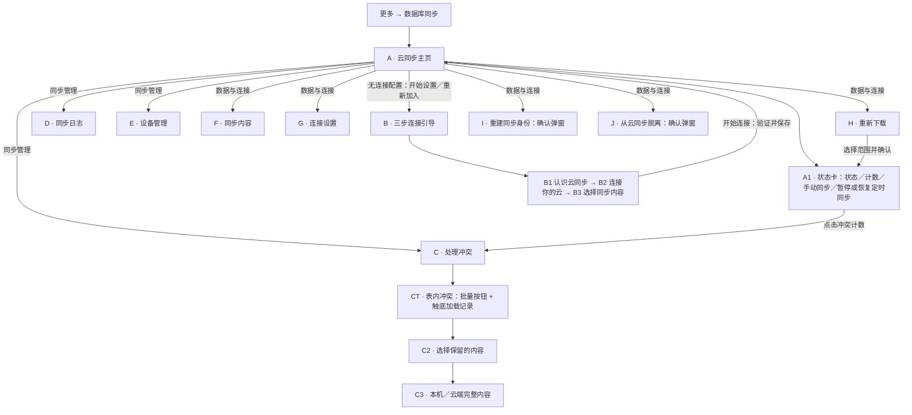
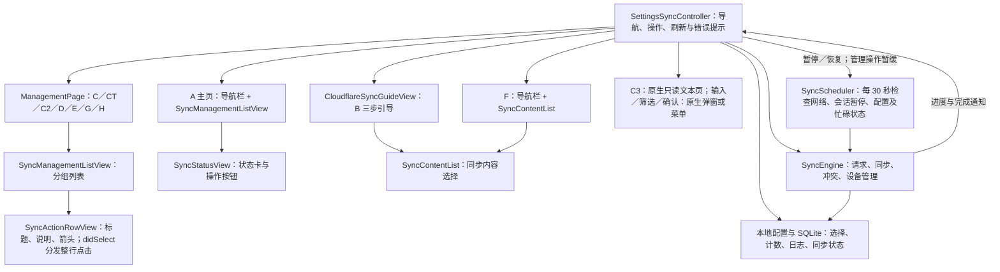
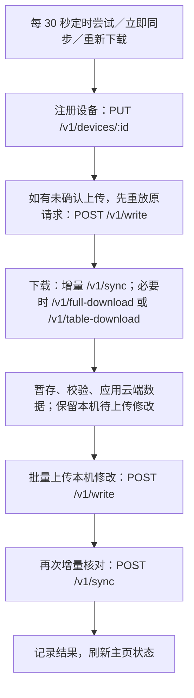

# 云同步 UI 与功能架构图

基于 2026-09-29 工作区实现。编号用于讨论 UI 调整，不代表新设计；箭头表示进入页面或触发操作。

## 页面导航

主页只有存在连接配置时才显示 C～J；这不代表服务器此刻一定可连接。无配置时显示连接引导入口和本机数据保留说明。

## 控件与功能对应

| 编号 | 页面／控件 | 点击后的功能或展示来源 |
| --- | --- | --- |
| A1.1 | 状态标题与说明 | 展示未连接、准备就绪、同步中、完整下载中、定时同步已暂停或有冲突；说明显示最近同步时间、进度或错误。 |
| A1.2 | 待上传／本轮下载／冲突 | 待上传和冲突来自已启用内容的本地队列；本轮下载是实际收到的记录次数，可能包含补拉重复记录；冲突计数可进入 C。 |
| A1.3 | 立即同步／同步中… | `start()` → `syncEngine.synchronize()`；自动任务运行时同样禁用并显示“同步中…”。暂停定时同步时仍可手动同步；未连接时显示“加入同步”，进入 B。 |
| A1.4 | 暂停同步／恢复同步 | `syncScheduler.setPaused()`；只控制本次应用运行期间的定时任务，不中断正在运行的任务。 |
| B1 | 认识云同步 | 原理、额度说明、外部文档链接；“我已了解”进入下一页。 |
| B2 | 连接你的云 | 部署引导链接；填写设备名、API 根地址、主密钥；“下一步”进入 B3。 |
| B3 | 选择同步内容／开始连接 | `configure()` → `setDeviceName()` → `connectionTest()` → `selectTables()`；成功返回主页，之后由定时任务同步，也可点击“立即同步”。 |
| C1 | 冲突总览 | 第一组为“保留全部本机内容／保留全部云端内容”两个无副标题按钮；第二组列出有冲突的表，副标题显示冲突数。右上角刷新本地统计。 |
| CT | 表内冲突 | 第一组为“保留该表本机内容／保留该表云端内容”两个无副标题按钮；第二组为冲突记录。仅查询本地队列，首批 50 条，`didReachBottom` 触底追加；浏览和刷新不等待网络或引擎锁，右上角刷新重新加载首批。 |
| C1／CT 批量操作 | 全部或单表选择版本 | 确认后 `resolveConflicts()` 按 50 条读取并处理；占用引擎锁，校验本机修订及云端版本。失败项保留，结果显示已处理、失败及剩余数量。 |
| C2.1 | 本机内容／云端内容 | 立即打开并展示本机预览；云端先显示“正在读取云端内容”，待引擎可用后异步获取最新版本并更新。失败时原位显示错误与重试；读取期间可查看本机完整内容或返回，关闭后不再刷新旧页面。 |
| C2.2 | 使用本机内容 | 确认后 `resolve(..., "local", ...)`；清除该项冲突标记，以展示的云端版本为基线，下次同步上传。 |
| C2.3 | 保留云端内容 | 确认后 `resolve(..., "cloud", ...)`；立即应用已读取的云端版本，移除该项待上传修改。 |
| C2.4 | 刷新云端内容／稍后处理 | 前者原位异步调用 `readConflicts()`，加载期间禁用版本选择；后者立即返回列表并保留冲突。 |
| C3 | 完整内容页 | 只读文本展示记录完整内容；不发送额外请求。 |
| D1 | 导航栏右侧“筛选” | 原生菜单选择全部／成功／提示／错误；当前条件显示在记录分组标题中，取消不改变筛选。 |
| D2 | 最近记录 | 合并本地操作摘要和同步错误，按时间倒序展示；不是网络请求诊断日志。 |
| E1 | 导航栏右侧“刷新” | `devices()` 分页获取云端设备列表；页面分为“本机设备”和“其他设备”两个分组。 |
| E2 | 本机设备分组：点击设备名 | 输入新名称 → `renameDevice()` → 注册接口更新名称 → 刷新列表。 |
| E3 | 其他设备分组：点击设备 | 确认启用／禁用 → `setDeviceDisabled()` → 刷新列表；无其他设备时显示空状态。本机被禁用时，本机分组另显示“启用本设备”入口。 |
| F1 | 同步内容开关列表 | 本页暂存选择；关闭“图库记录”时，其依赖项开关不可操作且不纳入最终选择。 |
| F2 | 导航栏“保存” | `selectTables()` 保存选择；新增内容在下次同步时下载，返回不会自动执行同步。 |
| G1 | API 根地址 | 输入弹窗编辑并校验 HTTPS 根地址，保存在本页草稿中。 |
| G2 | 主密钥 | 安全输入弹窗编辑并校验 64 位小写十六进制密钥；列表显示掩码。 |
| G3 | 导航栏右侧“保存并验证” | 地址变化时先确认切换服务器；`configure()` → `setDeviceName()` → `connectionTest()`，成功返回。保存发生在网络验证之前，验证失败也可能已更新配置。 |
| H1 | 全部已选内容 | 确认 → 返回主页 → `start(true)` → `synchronize(..., true)`。 |
| H2 | 按项下载 | 仅列出已启用内容，使用无副标题的紧凑行，最小高度 48 pt；确认 → 返回主页 → `redownloadTable(table)` → `synchronize()`。无选择时显示空状态说明。 |
| I | 重建同步身份 | 确认后 `resetIdentity()`：生成新设备 ID、重置请求序号、标记需要完整下载；下一次同步时注册和下载。 |
| J | 从云同步脱离 | 确认后 `leave()`：移除连接与同步状态，保留本机业务数据及云端数据；主页回到未连接状态。 |

**重新下载的实际行为：** H1、H2 最终都会运行同步流程，包含待上传修改的处理；它们不是仅执行下载的独立任务。H2 在已有完整基线时按表下载，否则可能先建立完整基线。

**内容选项：** 图库记录、阅读进度、图库收藏状态、图库评分、单个图库阅读设置、图片收藏、全局阅读设置、搜索历史、搜索书签、本地标签标记、上传者标记、标签访问次数、WebDAV 服务、AI 翻译服务，共 14 项。B3 与 F 复用同一选择组件；H2 从相同表定义生成已启用项。

## UI 组件与控制关系

多数操作经过 `action()` → `run()`，防止重复执行并统一错误提示；结束或取消后释放操作锁。暂停／恢复定时同步使用独立入口，可在同步运行时触发。管理操作期间定时任务会跳过本轮。连接引导通过自身按钮状态防止重复提交。

`ManagementPage` 支持可选的导航栏右侧按钮，C、CT、E 使用“刷新”，D 使用“筛选”，G 使用“保存并验证”。普通操作行有标题＋副标题和仅标题两种模板，均通过列表 `didSelect` 处理整行点击。

主要视觉复用范围：修改 `SyncActionRowView` 会影响所有管理分组中的普通行；修改 `ManagementPage` 会影响 C、CT、C2、D、E、G、H；B、F、C3 有各自的页面结构。

## 引擎调用与接口

| UI 功能 | 云端调用 | 本地结果 |
| --- | --- | --- |
| 连接验证、本设备改名 | `PUT /v1/devices/:id` | 保存配置／设备状态；连接验证包含注册或更新设备。 |
| 查看或刷新单条冲突的云端内容 | 页面先打开，随后注册设备并 `POST /v1/read` | 获取用户决策所需的当前云端版本；不推进全局同步游标。 |
| 选择冲突版本 | 选择当下不直接调用写入接口 | 选择云端立即应用；选择本机排队等待下次上传。 |
| 获取设备列表 | `GET /v1/devices`，自动分页 | 展示设备及其访问状态。 |
| 启用／禁用设备 | `PATCH /v1/devices/:id` | 更新列表，不删除已有云端数据。 |
| 内容选择、日志筛选、重建身份、脱离 | 操作本身不请求云端 | 修改本地状态或展示本地数据。 |

所有同步请求的诊断记录走 `syncLog()` → `appLog`：请求为 `info`，错误为 `error`，主密钥等敏感字段先脱敏；日志是否输出受全局日志等级控制。D 页面展示的是操作摘要，不直接展示这些请求详情。

## 代码位置

- [页面导航与操作](../src/controllers/settings-sync-controller.ts)
- [状态卡、普通行和分组列表](../src/components/sync-management-view.ts)
- [三步引导与同步内容选择](../src/components/sync-guide-view.ts)
- [同步引擎及接口调用](../src/sync/engine.ts)
- [定时调度与会话暂停](../src/sync/scheduler.ts)
- [本地同步状态](../src/sync/store.ts)
- [同步内容定义](../src/sync/schema.ts)
- [请求日志与脱敏](../src/sync/logging.ts)

讨论示例：“调整 A1.2 的计数排布”“调整 G3 的按钮文案”“让 C2.1 改成左右对比”。
